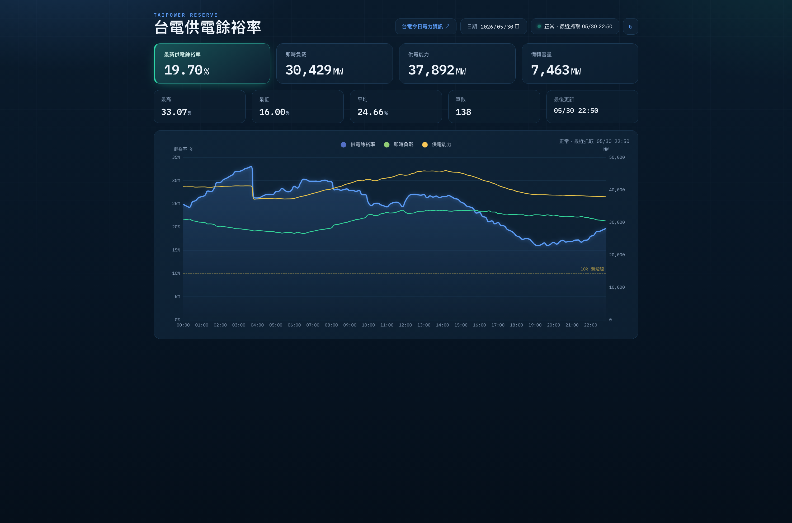

# ⚡ 台電供電餘裕率 · Taipower Reserve Margin

即時追蹤台灣電力系統的「供電餘裕率」,每數分鐘抓取台電開放資料,儲存整天的時間序列,並以網頁畫出**全日變化曲線**。

🌐 **線上 Demo:** <https://taipower-reserve.zeabur.app>



---

## ✨ 功能

- **全日曲線**:供電餘裕率、即時負載、供電能力三線同圖,每 5 分鐘更新一筆。
- **即時卡片**:最新餘裕率、負載、供電能力、備轉容量。
- **當日統計**:最高 / 最低 / 平均餘裕率、資料筆數、最後更新時間。
- **供電燈號**:依餘裕率自動變色(綠 ≥10%、黃 6–10%、橘 3–6%、紅 <3%),主卡片發光提示。
- **歷史回看**:日期選擇器可瀏覽過去任一天;每次開啟自動跳到今天。
- **資料持久化**:SQLite 存於 Zeabur Volume,重新部署不掉資料。

## 📊 資料來源與算法

資料取自台電**開放資料**(不擋國外 IP,雲端可直接抓):

```
https://service.taipower.com.tw/data/opendata/apply/file/d006020/001.json
```

| 欄位 | 意義 |
|------|------|
| `curr_load` | 即時負載(萬瓩) |
| `real_hr_maxi_sply_capacity` | 即時估算供電能力(萬瓩) |
| `publish_time` | 民國時間戳,如 `115.05.30(六)22:40` |

> 台電原始單位為「萬瓩」(1 萬瓩 = 10 MW),顯示時換算為 MW。

**供電餘裕率** = (供電能力 − 即時負載) ÷ 供電能力 × 100% = 1 − 使用率
> 代表「供電能力還剩幾成沒被用掉」。與台電官方「備轉容量率」(分母為負載)定義不同,本站採用餘裕率以直覺反映即時剩餘餘裕。

## 🏗️ 架構

```
Zeabur (Tokyo) · FastAPI 服務
 ├─ APScheduler 每 5 分鐘 ── fetch_and_store() ── 抓開放資料 → 解析 → 寫入 SQLite
 ├─ GET /                      圖表頁(ECharts 單頁)
 ├─ GET /api/history?date=…    某日所有資料點
 ├─ GET /api/dates             有資料的日期清單
 ├─ GET /api/latest            最新一筆
 └─ POST /api/ingest           備援:接受外部推送的台電 JSON
SQLite (Zeabur Volume /data)   ts 為主鍵,INSERT OR IGNORE 天然去重
```

## 🛠️ 技術

- **後端**:Python · FastAPI · APScheduler · httpx · SQLite
- **前端**:原生 HTML + ECharts(CDN)· IBM Plex 字體
- **部署**:Docker → Zeabur(GitHub 自動建置 + Volume 持久化)

## 🚀 本地執行

```bash
pip install -r requirements.txt
uvicorn app.main:app --reload --port 8080
# 開 http://localhost:8080/
```

資料庫預設寫在專案目錄 `taipower.db`;設環境變數 `DB_PATH` 可改路徑(Zeabur 上設為 `/data/taipower.db`)。

## ☁️ 部署到 Zeabur

1. 推到 GitHub,Zeabur 以 **Dockerfile** 建置。
2. 掛一顆 **Volume** 到 `/data`,並設環境變數 `DB_PATH=/data/taipower.db`。
3. Zeabur 注入 `PORT`,容器自動監聽;開啟 domain 即可使用。

## 🧯 備援機制

主來源為 Zeabur 內建排程器直抓開放資料。若該主機失效,可改用以下任一備援推送到 `/api/ingest`(皆保留於 repo,平常停用):

- `n8n_workflow.json` — n8n 排程流程(台灣節點)
- `push_from_mac.py` — 本機推送腳本
- `.github/workflows/push-taipower.yml` — GitHub Actions(手動觸發)

`ts` 為主鍵,任何來源重複寫入同一時間點都會自動忽略,不會產生重複資料。
